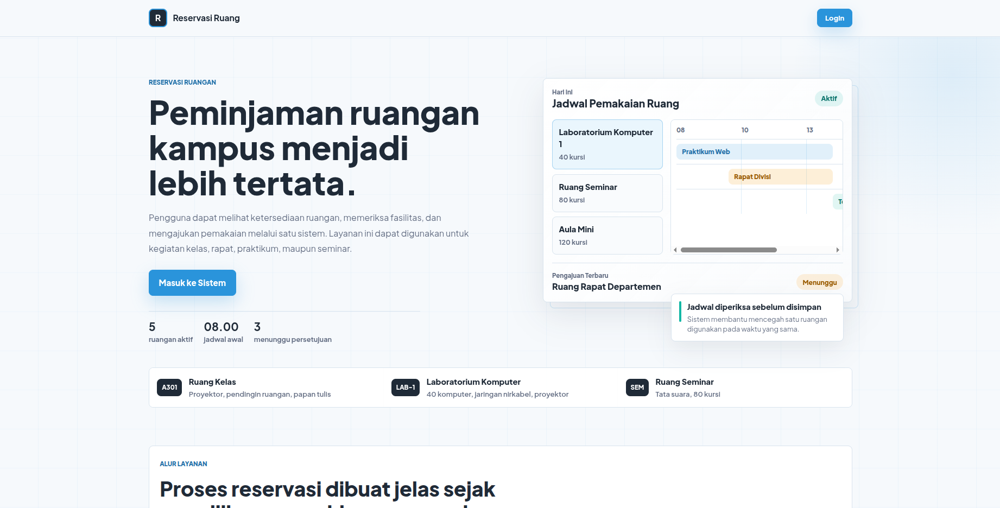
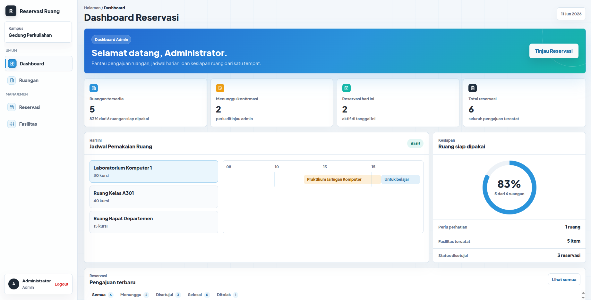
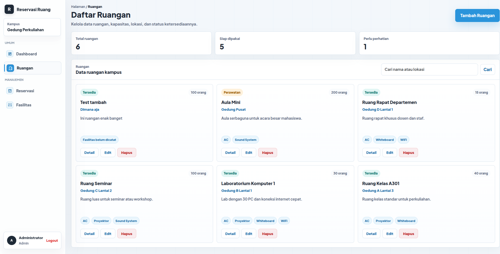
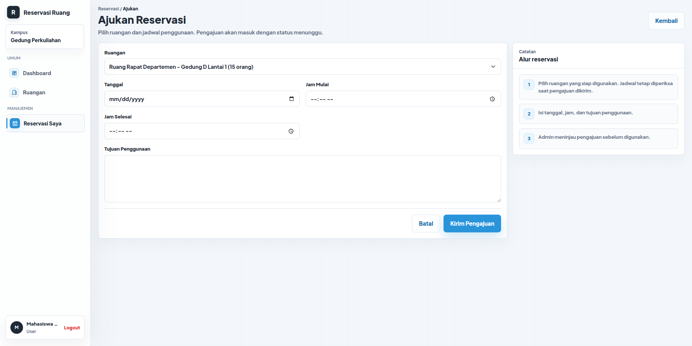
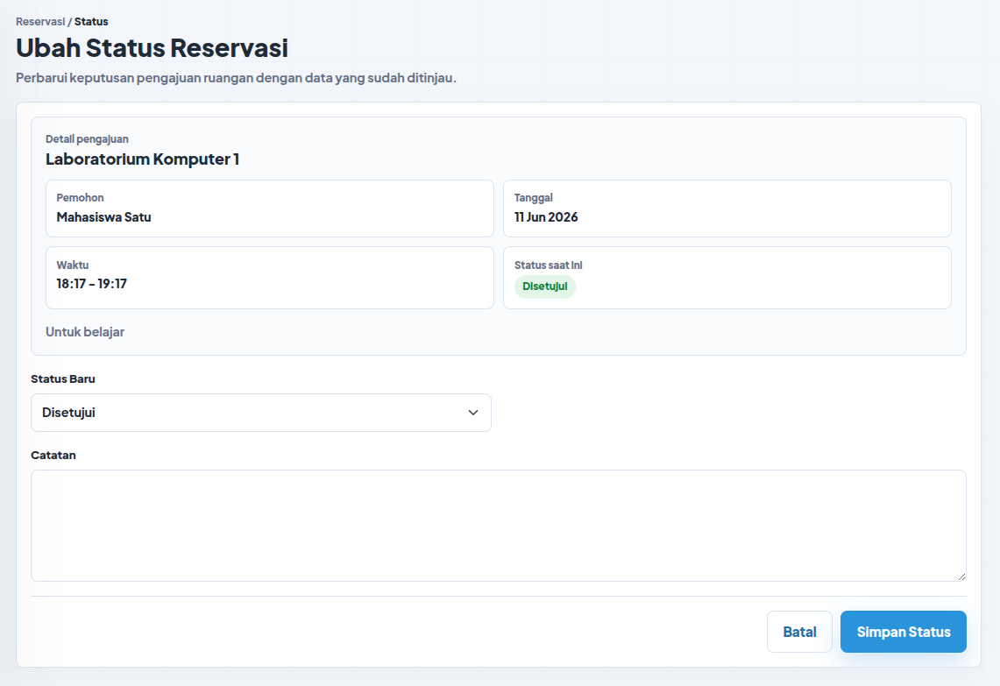

# Sistem Reservasi Ruangan Kampus

Sistem informasi berbasis web untuk memudahkan mahasiswa dan dosen dalam melihat ketersediaan ruangan, memeriksa fasilitas, dan mengajukan permohonan pemakaian ruangan kampus secara terpadu.

## 🚀 Fitur Utama

- **Pencarian Ruangan**: Lihat daftar ruangan lengkap dengan lokasi, kapasitas, status kesiapan, dan fasilitas.
- **Timeline Ketersediaan**: Periksa jam kosong pada detail ruangan sebelum mengajukan reservasi.
- **Reservasi Dinamis**: Sistem pengecekan jadwal otomatis untuk mencegah bentrok waktu penggunaan (*double-booking*).
- **Dashboard Interaktif**: Ringkasan reservasi, status pengajuan, dan jadwal pemakaian ruang.
- **Manajemen Fasilitas**: Admin dapat mencatat fasilitas spesifik per ruangan.
- **Validasi Terpadu**: Validasi di sisi *client* (JavaScript) dan *server* (PHP) untuk mencegah input data yang keliru.
- **Mobile-Friendly**: Tampilan responsif dan proporsional untuk digunakan di desktop maupun smartphone.

## 💻 Teknologi yang Digunakan

- **Frontend**: HTML5, Vanilla CSS3, JavaScript (ES6+).
- **Backend**: PHP 8.x (Native).
- **Database**: MySQL.
- **Arsitektur**: Monolithic dengan struktur folder rapi (pemisahan logika dan *view*).

## 🛠 Panduan Instalasi (XAMPP / Laragon)

1. Pastikan Anda sudah meng-install **XAMPP** atau **Laragon**.
2. *Clone* atau ekstrak repositori ini ke dalam folder *document root* Anda:
   - XAMPP: `C:\xampp\htdocs\uas_ppw_s2`
   - Laragon: `C:\laragon\www\uas_ppw_s2`
3. Nyalakan service **Apache** dan **MySQL**.
4. Buka phpMyAdmin (biasanya di `http://localhost/phpmyadmin`).
5. Buat database baru dengan nama `db_reservasi_ruangan`.
6. Import file `database.sql` yang ada di root folder aplikasi ini ke dalam database tersebut.
7. Pastikan konfigurasi database di file `includes/config.php` (bila digunakan) sudah sesuai dengan kredensial MySQL lokal Anda.
8. Buka browser dan akses: `http://localhost/uas_ppw_s2/`

## 🔐 Akun Demo

Anda dapat menggunakan akun berikut untuk mencoba sistem:

**Administrator:**
- **Email:** admin@kampus.ac.id
- **Password:** admin123

**Pengguna / Mahasiswa:**
- **Email:** mahasiswa1@kampus.ac.id
- **Password:** user123

**Pengguna / Mahasiswa 2:**
- **Email:** mahasiswa2@kampus.ac.id
- **Password:** user123

## 📸 Tangkapan Layar (Screenshots)

### 1. Halaman Beranda (Landing Page)

### 2. Dashboard & Grid Jadwal

### 3. Daftar Ruangan

### 4. Form Reservasi

### 5. Manajemen Status Reservasi

